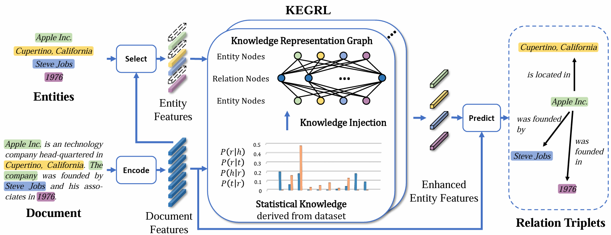

# Knowledge-Embedded Graph Representation Learning for Document-Level Relation Extraction

## Introduction of KEGRL📑
### Overview
The framework architecture of KEGRL is illustrated in the following diagram:



### DocRE Models
We employ KEGRL across eight distinct DocRE models. Each model and the corresponding paper are linked below:
| Model     | Citation                                                                                                                |
| -------- |-------------------------------------------------------------------------------------------------------------------------|
| CNN   | [Yao *et al.*, 2019](https://arxiv.org/abs/1906.06127v3) |
| LSTM   |  [Yao *et al.*, 2019](https://arxiv.org/abs/1906.06127v3) |
| BiLSTM   |  [Yao *et al.*, 2019](https://arxiv.org/abs/1906.06127v3) |
| Context-aware   | [Yao *et al.*, 2019](https://arxiv.org/abs/1906.06127v3) |
| LSR-Glove   | [Nan *et al.*, 2020](https://arxiv.org/abs/2005.06312)                                                            |
| LSR-Bert   | [Nan *et al.*, 2020](https://arxiv.org/abs/2005.06312)                                                                |
| ATLOP-Bert   | [Zhou *et al.*, 2021](https://arxiv.org/abs/2010.11304)     |
| ATLOP-Roberta   | [Zhou *et al.*, 2021](https://arxiv.org/abs/2010.11304)     |

### Datasets
We conducted experiments on three benchmark document-level relation extraction datasets: [DocRED](https://github.com/thunlp/DocRED), [Re-DocRED](https://github.com/tonytan48/Re-DocRED) and [DWIE](https://github.com/klimzaporojets/DWIE).

### File Structure
The main file structure is as follows:
```python
KEGRL
├── ATLOP+KEGRL
│   ├── outputs # store the optimal model during training
│   ├── configs # configuration files used to run different experiments with different settings
│   ├── data # the code for processing the data
│   ├── model # the code for ATLOP model and KEGRL module
│   └── config.py # the code for defining the hyperparameters
├── DocRED4+KEGRL
│   ├── output # store the optimal model during training
│   ├── config
│   │   ├── Config.py # the code for trainning and testing
│   │   └── g_config.py # the code for defining the hyperparameters
│   ├── models # the code for DocRE model and KEGRL module
│   └── yamls # configuration files used to run different experiments with different settings
├── LSR+KEGRL
│   ├── checkpoint # store the optimal model during training
│   ├── code_bert # the code for LSR-Bert model
│   ├── config # the code for training and testing
│   └── models # the code for LSR model and KEGRL module
├── dataset # datasets
│   ├── DWIE
│   ├── DocRED
│   └── Re-DocRED
├── data_analysis.py # the code for generating edge weights
└── other directories or files
```

## Getting Started🚀
### Dependencies
* Python (tested on 3.8.11)
* CUDA 11.7
* [PyTorch](http://pytorch.org/) (tested on 1.13.1)
* [Transformers](https://github.com/huggingface/transformers) (tested on 3.1.0)
* [dgl](https://www.dgl.ai/) (tested on 1.0.1)
* [opt-einsum](https://github.com/dgasmith/opt_einsum) (tested on 3.3.0)
* spacy (tested on 3.5.3)
* networkx (tested on 3.1)
* pytorch_transformers (tested on 1.2.0)
* numpy (tested on 1.23.0)
* scipy (tested on 1.8.1)
* en_core_web_sm (tested on 3.5.0)
* scikit-learn

### Install
Run the following command to install dependencies:
```bash
# Pytorch
pip install torch==1.13.1+cu117 torchvision==0.14.1+cu117 torchaudio==0.13.1 --extra-index-url https://download.pytorch.org/whl/cu117

# dgl
pip install dgl==1.0.1 -f https://data.dgl.ai/wheels/cu117/repo.html
pip install dglgo -f https://data.dgl.ai/wheels-test/repo.html

# Other dependencies
pip install -r requirements.txt

# en_core_web_sm
python -m spacy download en_core_web_sm
# or 
wget https://github.com/explosion/spacy-models/releases/download/en_core_web_sm-3.5.0/en_core_web_sm-3.5.0.tar.gz
pip install en_core_web_sm-3.5.0.tar.gz
```

### Data Preparation
Download datasets (directories) from [Google Drive](https://drive.google.com/drive/folders/1rBZ-HFhz5Kt4j37umko44GsMDBQRyu9T?usp=sharing) and put them to `dataset/`.

For DocRED4 and LSR, data needs to be preprocessed before training:
```bash
cd DocRED4+KEGRL
bash prepro.sh

cd LSR+KEGRL
bash prepro.sh
```
For ATLOP, data will be preprocessed when running `train.py` and `test.py`.

### Statistical Knowledge Acquirement
Make sure `dataset/` exists corresponding three dataset directories.

Run the following command to acquire statistical knowledge:
```bash
python data_analysis.py
```
It will generate weight file `train_rely_weight.json` in each dataset directories for training and testing.

### Training
Train and test the ATLOP and ATLOP+KEGRL model with the following commands:
```bash
cd ATLOP+KEGRL
# training
bash run.sh

# testing
bash test.sh
```
See ATLOP+KEGRL [README](ATLOP+KEGRL/README.md) for details.

---

Train and test the LSR and LSR+KEGRL model with the following commands:
```bash
cd LSR+KEGRL
# training
bash run.sh # On DocRED dataset
bash run_re.sh # On Re-DocRED dataset
bash run_dwie.sh # On DWIE dataset

# testing
bash test.sh # On DocRED dataset
bash test_re.sh # On Re-DocRED dataset
bash test_dwie.sh # On DWIE dataset
```
See LSR+KEGRL [README](LSR+KEGRL/README.md) for details.

---

Train and test the DocRED4 and DocRED4+KEGRL model with the following commands:
```bash
cd DocRED4+KEGRL
# training
bash run.sh

# testing
bash test.sh
```
See DocRED4+KEGRL [README](DocRED4+KEGRL/README.md) for details.

### Run Pretrained Models
We open source ATLOP+KEGRL [checkpoint](https://drive.google.com/drive/folders/1phDxrPMsIgKRpNO39n3yMVWSrzOQ5Mvc?usp=sharing) on Re-DocRED and reproduce metrics with the following command:
```bash
cd ATLOP+KEGRL/

# SGRAPH.pth
python test.py --ckpt path_to_checkpoint --config configs/sgraph_re.yaml

# DGRAPH.pth
python test.py --ckpt path_to_checkpoint --config configs/dgraph_re.yaml
```

## Reference🔗
[ATLOP](https://github.com/wzhouad/ATLOP)

[LSR](https://github.com/nanguoshun/LSR)

[DocRED4](https://github.com/thunlp/DocRED)

## License📄
This project is licensed under the GPL License - see the [LICENSE](LICENSE) file for details

## Citation🚩
```

```
